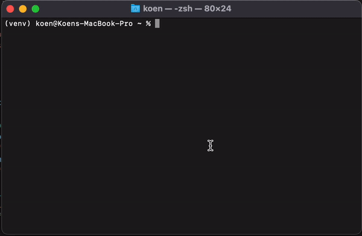

# GPTerm

GPTerm is what ChatGPT is to GPT-3. Instead of a web interface, you can access it from your terminal.



## Requirements
- Python 3.6+
- OpenAI API key    

## Install
```
pip install git+https://github.com/koenvaneijk/gpterm
```
## Usage
In your terminal:
```bash
gpterm
```

